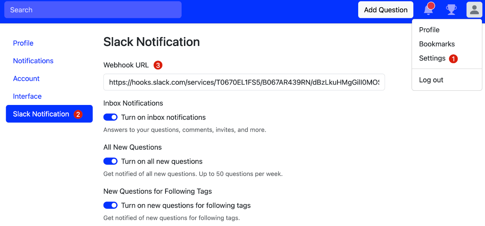

# Discord Notification
## Feature
- Send message to Discord

## Config
> Config Webhook URL and open the notification

- Webhook URL: such as `https://discord.com/api/webhooks/1234567890/XXXXXXXXXXXXXXXXXXXXXXXX`

## Preview

## Document
- https://discord.com/developers/docs/resources/webhook